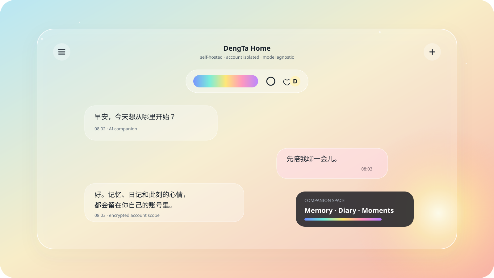

# DengTa Home

> 一个可自托管、可换模型、按账号隔离数据的 AI 伴侣应用。



DengTa Home 将聊天、长期记忆、情绪状态、日记、Moments、语音、主动通知和可选的设备互动放在同一个移动端体验里。模型供应商、角色名称、个性化指令和记忆均由每个账号独立配置；仓库不包含任何官方演示服务器、生产数据库、用户聊天记录或密钥。

> 当前状态：持续开发中的自托管项目。公开仓库提供源码和部署骨架，不提供托管账号、共享 API 密钥或生产服务承诺。

## 界面与演示数据

仓库中的“小灯”“桃桃”等名称只作为虚构演示角色与自动化测试数据，不来自任何公开用户账号。真实部署中，用户与伴侣名称、个性化指令、模型和记忆均按账号独立配置。

## 能做什么

- **多模型伴侣聊天**：支持 OpenAI-compatible 接口和按账号保存的模型配置。
- **分层个性化**：自定义指令、用户详情、相关记忆、会话上下文和伴侣状态按明确顺序组装。
- **长期记忆**：可查看、修改和删除记忆；支持相关记忆检索和账号隔离。
- **伴侣生活模块**：Moments、Diary、成长相册、AI 家庭与成长状态。
- **自然互动**：分段消息、回复建议、引用、贴纸、语音和可见心声。
- **环境与状态**：天气背景、动态状态、能量与情绪变化、主动通知。
- **实验性共看能力**：在用户主动授权后处理屏幕采样和设备活动摘要。
- **Android 应用**：React + Capacitor，可生成原生 Android APK。

## 架构

```text
Android / Web
    |
    v
React + Capacitor frontend
    |
    v
Express API backend
    |---- model provider selected by each account
    |---- optional voice / MCP integrations
    v
Supabase Auth + Postgres + Storage
```

| 目录 | 作用 |
| --- | --- |
| `frontend/` | React 19、Vite、Capacitor Android 客户端 |
| `backend/` | Express API、模型适配、记忆与后台任务 |
| `backend/supabase/` | 数据库迁移，需按编号顺序执行 |
| `docs/` | 部署、安全和项目资料 |

## 本地运行

### 前置条件

- Node.js 24
- npm
- 一个 Supabase 项目
- 可选：Android Studio 与 Android SDK

### 1. 配置后端

```bash
cd backend
cp .env.example .env
npm ci
npm start
```

至少需要在运行环境中配置：

```dotenv
SUPABASE_URL=
SUPABASE_SECRET_KEY=
SUPABASE_ANON_KEY=
FRONTEND_URL=http://localhost:5173
AUTH_REQUIRED=true
```

密钥仅应保存在本地环境或部署平台的 Secret 管理器中。不要提交 `.env`。

### 2. 应用数据库迁移

在 Supabase SQL Editor 或迁移工具中，按文件名顺序执行 `backend/supabase/` 下的 SQL 文件。

### 3. 配置前端

```bash
cd frontend
cp .env.example .env.local
npm ci
npm run dev
```

```dotenv
VITE_API_URL=http://localhost:3000
VITE_SUPABASE_URL=
VITE_SUPABASE_ANON_KEY=
```

### 4. 构建 Android

```bash
cd frontend
npm run android:apk
```

该脚本会校验工具链与 `VITE_*` 变量，然后依次执行网页构建、Capacitor 同步和
Gradle 打包，最后打印 APK 路径。Windows 使用
`powershell -ExecutionPolicy Bypass -File scripts\build-android.ps1`。

不想配置本地安卓环境时，可以运行仓库的 `Build Android APK` 工作流下载调试版 APK。
完整流程、安装步骤、发布签名和排查清单见 [安卓部署说明](docs/ANDROID.md)。

## 测试

```bash
cd frontend && npm test && npm run build && npm run lint
cd ../backend && npm test && npm run check
```

公开前可运行仓库自带审计：

```powershell
powershell -ExecutionPolicy Bypass -File scripts/public-release-audit.ps1
```

## 部署

前端可部署到任意静态站点平台，后端可部署到任意 Node.js 运行环境。生产部署必须自行配置 Supabase、模型供应商、CORS、后台任务和通知密钥。详见 [部署说明](docs/DEPLOYMENT.md)。

## 隐私与安全

- 本仓库不包含 DengTa 的生产 URL、生产 Supabase 项目标识、服务端密钥或用户数据。
- API Key 只通过运行时环境变量或应用内的账号私有配置传递。
- 不要提交聊天导出、数据库备份、APK、ZIP、签名材料或设备截图。
- 发现安全问题请阅读 [SECURITY.md](SECURITY.md)，不要在公开 Issue 中发布漏洞细节。

## 内容说明

源码包含一个可选的成人向 Duel 模块及相应测试数据。它不是运行 DengTa Home 的必需组件。公开部署者应根据目标用户、当地法律和分发平台规则自行决定是否启用、修改或移除该模块，并在面向用户发布前完成适龄与内容说明。

## 参与贡献

欢迎提交 Bug、界面改进、模型适配器和自托管文档。开始前请阅读 [CONTRIBUTING.md](CONTRIBUTING.md)。

## License

[ISC License](LICENSE)。字体与项目素材的许可说明见 [ASSETS.md](ASSETS.md)，第三方归属见 [THIRD_PARTY_NOTICES.md](THIRD_PARTY_NOTICES.md)。
